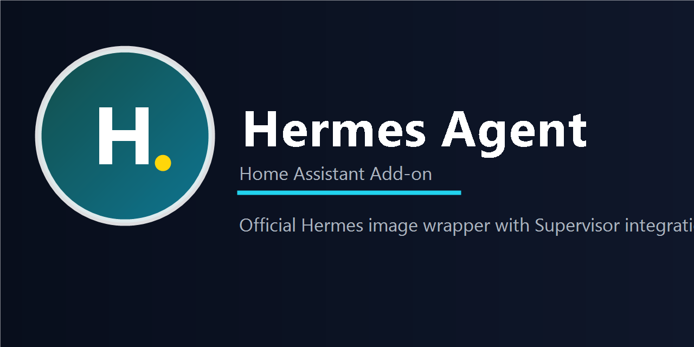

# Hermes Agent Home Assistant Add-on Repository

This repository contains a Home Assistant add-on for running Hermes Agent with Home Assistant-aware defaults while staying close to the official Hermes Docker runtime.

## Install

Click the button above to add this repository to your Home Assistant instance.

If you prefer to add it manually:

1. Open `Settings -> Add-ons -> Add-on Store`.
2. Open the overflow menu in the top-right corner and choose `Repositories`.
3. Add `https://github.com/sunboss/hermes-agent-ha-addon`.
4. Find **Hermes Agent** in the store and open it.
5. After startup, use **OPEN WEB UI** to launch the built-in ingress chat interface.

## Quick Start

1. Install the add-on from this repository.
2. Set `llm_model` (default: `NousResearch/Hermes-4-14B`; also available: `NousResearch/Hermes-4-70B`, `NousResearch/Hermes-4-405B`, `NousResearch/Hermes-4.3-36B`).
3. Choose `auth_mode`.
4. If `auth_mode=api_key`, set credentials via one of:
   - `huggingface_api_key` (for NousResearch models on HuggingFace Inference API)
   - `openrouter_api_key` (for OpenRouter)
   - `openai_base_url` + `openai_api_key` (for any OpenAI-compatible endpoint)
5. Keep `terminal_backend` on `local` for the first run.
6. Start with a narrow `watch_domains` list.
7. Start the add-on and check the logs.
8. Open **OPEN WEB UI** from the add-on page.
9. Use **进入命令行面板** when you want the full ttyd shell experience.

## Add-ons

### [Hermes Agent](./hermes_agent)

Wraps the official [`nousresearch/hermes-agent`](https://hub.docker.com/r/nousresearch/hermes-agent) image and injects Home Assistant Supervisor access plus add-on managed Hermes settings.

## First Configuration

Start with these settings:

- `llm_model`: defaults to `NousResearch/Hermes-4-14B`; other Hermes 4 options: `NousResearch/Hermes-4-70B`, `NousResearch/Hermes-4-405B`, `NousResearch/Hermes-4.3-36B`
- `auth_mode: api_key` for the current working chat path
- `huggingface_api_key` for NousResearch models via HuggingFace Inference API, or `openrouter_api_key`, or `openai_base_url` + `openai_api_key`
- `terminal_backend: local`
- a narrow `watch_domains` list such as `climate`, `binary_sensor`, or `light`

## Web UI

- Uses Home Assistant Ingress, so no extra port mapping is needed
- Talks to Hermes through the add-on's internal OpenAI-compatible API server
- Keeps the Hermes API bound to `127.0.0.1` and proxies requests through the ingress-only UI server
- Ships with a polished chat-first control surface plus a dedicated ttyd terminal workspace
- Exposes `/auth/status`, `/auth/start`, `/auth/exchange`, `/auth/refresh`, and `/auth/logout`

## Browser Login Bridge

- `auth_mode=web_login` now supports a real PKCE login flow for `openai_web`
- The bridge can generate a browser login URL, accept the callback URL, exchange the code, refresh the stored session, and persist state in `/data/auth`
- The bridge now persists the OpenAI Codex browser session and exposes it to Hermes through a local OpenAI-compatible shim
- The `api_key` path remains available, but `auth_mode=web_login` is now wired for the in-container shim as well

## Notes

- The add-on stores Hermes runtime data in `/data`.
- The wrapper patches `/data/config.yaml` and `/data/.env` instead of replacing the whole runtime layout.
- The Web UI now includes a mobile-friendly ttyd terminal page for direct shell configuration.
- The internal Hermes API server is enabled automatically for the ingress UI.
- Upstream Hermes image updates are pinned intentionally rather than following `latest`.

## Docs

- Add-on docs: [hermes_agent/DOCS.md](./hermes_agent/DOCS.md)
- Install guide: [INSTALL.md](./INSTALL.md)
- Official Hermes docs: [hermes-agent.nousresearch.com/docs](https://hermes-agent.nousresearch.com/docs/)

