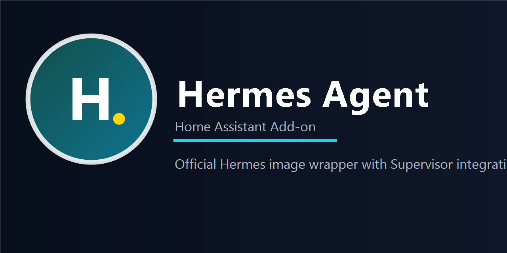

# Hermes Agent Home Assistant Add-on Repository

[中文说明 (Chinese)](#中文说明) | [English Overview](#english-overview)

---

## 中文说明

本仓库提供适用于 Home Assistant 的官方 `Hermes Agent` 智能体加载项。

### 核心特性
- **HA Ingress 原生直达**：在 Home Assistant 侧边栏点开即直接进入官方 Dashboard 控制面板，无需多余点击。
- **局域网 9119 直连**：开放 `9119` 端口，支持在浏览器中独立全屏流畅对话，摆脱 Ingress 嵌套。
- **开放 API 服务**：开放 `8642` 端口（OpenAI 格式标准接口），支持外部客户端（如 Open WebUI）直接接入。
- **精简高可靠架构**：剔除冗余命令行终端（ttyd），大幅缩短镜像构建时间并节约运行内存。
- **彻底解决 WebSocket 握手 403 阻断**：全自动清洗并伪装 Origin 请求头，保障打字机实时流式对话畅通无阻。
- **数据持久化安全**：遵循 Home Assistant 标准 `addon_config:rw` 规范，所有模型配置、会话记录与 API 凭据持久保存在 `/config/.hermes/`。

**当前版本**：
- Add-on: `2026.9.22.7`
- Upstream Hermes: `v2026.9.21`

### 快速安装步骤
1. 在 Home Assistant 中进入 **配置 (Settings) -> 加载项 (Add-ons) -> 加载项商店 (Add-on Store)**；
2. 点击右上角菜单选择 **存储库 (Repositories)**；
3. 添加本仓库地址：`https://github.com/sunboss/hermes-agent-ha-addon`；
4. 找到并点击安装 **Hermes Agent**；
5. 在「配置」中填入您的 API Key（如 OpenAI 兼容端点 `https://api.1234r.com/v1` 及模型），启动即可开始对话！

---

## English Overview

This repository provides an official `Hermes Agent` add-on tailored for Home Assistant.

### Key Features
- **Direct Ingress Access**: Clicking Hermes Agent in the Home Assistant sidebar opens the official native Dashboard directly.
- **LAN Direct Access (Port 9119)**: Direct port mapping to `9119` for dedicated, full-screen, low-latency browser access without Ingress iframe nesting.
- **OpenAI-Compatible API (Port 8642)**: Standardized API service exposed on port `8642`, enabling easy integration with external clients (e.g., Open WebUI).
- **Streamlined Architecture**: Completely removed redundant external web terminals (ttyd), drastically cutting build times and saving memory.
- **WebSocket 403 Forbidden Resolved**: Transparent Origin spoofing ensures rock-solid real-time chat streaming.
- **Safe Data Persistence**: Uses Home Assistant's standard `addon_config:rw` storage layout; all sessions, skills, and configurations persist under `/config/.hermes/`.

**Current Versions**:
- Add-on: `2026.9.22.7`
- Upstream Hermes: `v2026.9.21`

### Quick Installation
1. Navigate to **Settings -> Add-ons -> Add-on Store** in Home Assistant;
2. Click the top-right menu and choose **Repositories**;
3. Add this repository URL: `https://github.com/sunboss/hermes-agent-ha-addon`;
4. Locate and install **Hermes Agent**;
5. Provide your API Key and endpoint (e.g. `https://api.1234r.com/v1`) under the Configuration tab, then start the add-on!

---

## 文档索引 / Documentation Index
- **插件使用文档 / User Guide**: [hermes_agent/DOCS.md](./hermes_agent/DOCS.md)
- **更新日志 / Changelog**: [hermes_agent/CHANGELOG.md](./hermes_agent/CHANGELOG.md)
- **升级与排障复盘 / Upgrade Log**: [docs/UPGRADE_LOG.md](./docs/UPGRADE_LOG.md)
- **运维操作日志 / Operations Log**: [OPERATIONS_LOG.md](./OPERATIONS_LOG.md)
- **Hermes 官方文档 / Official Docs**: [https://hermes-agent.nousresearch.com/docs/](https://hermes-agent.nousresearch.com/docs/)
